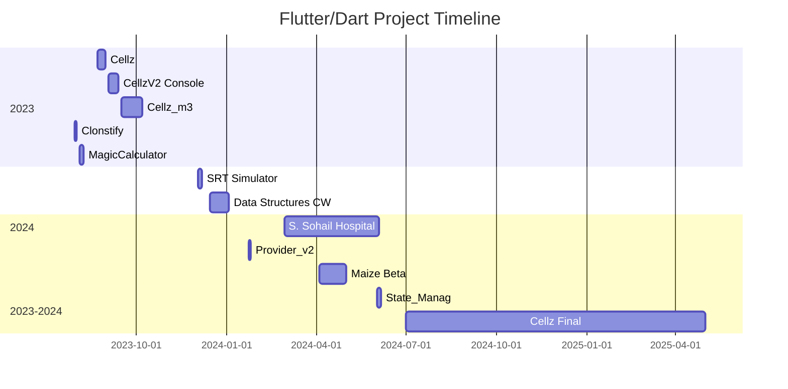

# Abdul Haseeb — Flutter & Dart Developer

**Email:** [Your Email]  
**GitHub:** [HaseebKahn365](https://github.com/HaseebKahn365)  
**Location:** [Your City, Country]  
**LinkedIn:** [Your LinkedIn]  
**Portfolio/Website:** [Your Portfolio if available]

---

## 🧠 Summary

Experienced and versatile Flutter & Dart developer with a strong background in building production-grade applications, games, and system tools. Over two years of dedicated work on personal and production projects ranging from puzzle games and multiplayer apps to complex AI-driven logic games. Focused on clean architecture, state management, and delivering scalable and performant mobile solutions.

---

## 🛠️ Skills

- **Languages:** Dart, C++, SQL, JavaScript
- **Frameworks/Platforms:** Flutter, Firebase, SQLite, Flame Engine
- **State Management:** Provider, Riverpod, GetX, MobX
- **Tools:** Git, GitHub, VS Code, Postman
- **Database:** Firestore, SQLite, SharedPreferences
- **Concepts:** AI game strategy, asynchronous programming, real-time multiplayer sync, MVVM architecture, offline-first design, responsive UI, animation pipelines

---

## 📊 Mermaid Diagram — Projects Timeline

# AI_ES (AI Assistant Embedded Systems)

## Project Links

- **Name:** AI_ES (AI Assistant Embedded Systems)
- **GitHub:** [github.com/HaseebKahn365/ai_es](https://github.com/HaseebKahn365/ai_es)
- **Timeline:** December 6, 2024 – February 17, 2025

## Overview

Cross-platform Flutter app that provides a voice control interface for AI assistant services, specifically designed to control an embedded system. The app sends speech-to-text to a Fast API endpoint, which then communicates with an LLM on a local machine. The LLM processes the text and returns a JSON response containing both voice data for the app and configuration data for an Arduino connected to the same machine.

### Core Goals

- Voice interface for AI services controlling an embedded system
- Customizable backend endpoints
- Speech-to-text & text-to-speech interaction
- Multi-platform support (Android, iOS, web, desktop)

## Core Functionality

### Screens & Flow

- **VoiceControlScreen:** Main interaction UI with voice recognition
- **SettingsScreen:** Configure backend endpoints

### Architecture Layers

- **UI Layer:** Screens & widgets
- **State Management:** Provider pattern (AIAssistantProvider)
- **Service Layer:** Speech recognition, HTTP communication

### Data Handling

- Real-time behavior (requires internet)
- In-memory endpoint URL storage
- Error handling via try-catch & provider states
- Navigation via MaterialPageRoute
- Custom animations (ListeningButton)

## Key Features

- Voice Recognition using speech_to_text
- Text-to-Speech via flutter_tts
- Configurable backend endpoints
- Visual feedback with animated elements
- Light/dark theme support
- Embedded System Control via LLM

## Technical Implementation

### Flutter/Dart Skills

- State Management: Provider + ChangeNotifier
- Routing: MaterialPageRoute
- Async Programming: async/await
- Custom Widgets: Animated components

### Architecture

- Pattern: Simplified MVVM
- Folder Structure: Flat organization
- Modular design for testability

### Third-Party Packages

- speech_to_text (v7.0.0)
- flutter_tts (v4.2.0)
- http (v1.2.2)
- provider (v6.1.2)

## Advanced Features

- LLM Integration with configurable endpoints
- Cross-platform support (Android minSdk 24, iOS, web, desktop)

## Technical Challenges & Solutions

1. **Speech Recognition**
    - Solution: speech_to_text with error handling
2. **Backend Flexibility**
    - Solution: Configurable endpoints + JSON standardization
3. **User Feedback**
    - Solution: Animations & loading states
4. **LLM and Embedded System Integration**
    - Solution: Fast API endpoint for communication between Flutter app, LLM, and Arduino.

## Developer Roles

**Abdul Haseeb:**

- Core architecture & state management
- Speech & TTS functionality
- UI design & backend communication
- Continuous development over 3 months

**Muhammad Bilal:**

- helped integrate the Flutter app with the Fast API endpoint.
- Configured the LLM to process speech text and generate JSON responses for voice data and Arduino configurations.
- Managed communication between the Fast API endpoint, LLM, and Arduino.
