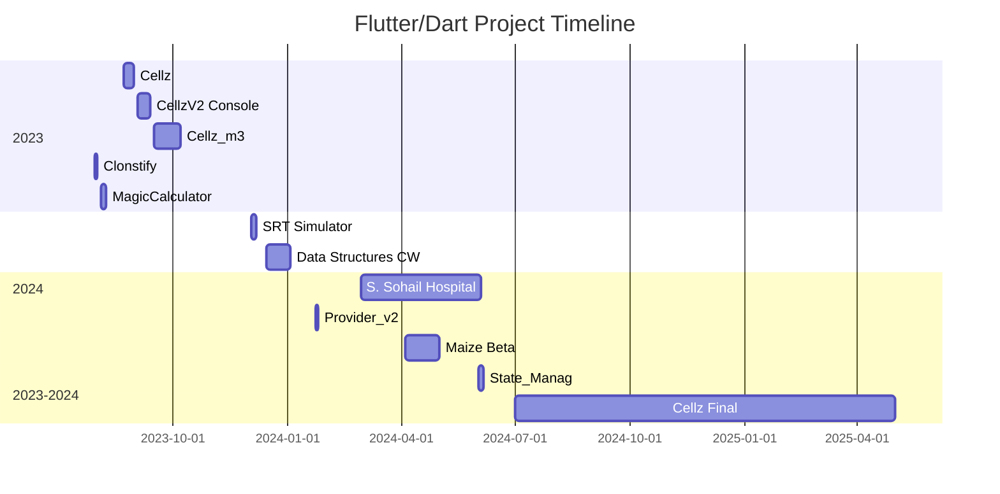

# Abdul Haseeb — Flutter & Dart Developer

**Email:** [Your Email]  
**GitHub:** [HaseebKahn365](https://github.com/HaseebKahn365)  
**Location:** [Your City, Country]  
**LinkedIn:** [Your LinkedIn]  
**Portfolio/Website:** [Your Portfolio if available]

---

## 🧠 Summary

Experienced and versatile Flutter & Dart developer with a strong background in building production-grade applications, games, and system tools. Over two years of dedicated work on personal and production projects ranging from puzzle games and multiplayer apps to complex AI-driven logic games. Focused on clean architecture, state management, and delivering scalable and performant mobile solutions.

---

## 🛠️ Skills

- **Languages:** Dart, C++, SQL, JavaScript
- **Frameworks/Platforms:** Flutter, Firebase, SQLite, Flame Engine
- **State Management:** Provider, Riverpod, GetX, MobX
- **Tools:** Git, GitHub, VS Code, Postman
- **Database:** Firestore, SQLite, SharedPreferences
- **Concepts:** AI game strategy, asynchronous programming, real-time multiplayer sync, MVVM architecture, offline-first design, responsive UI, animation pipelines

---

## 📊 Mermaid Diagram — Projects Timeline

